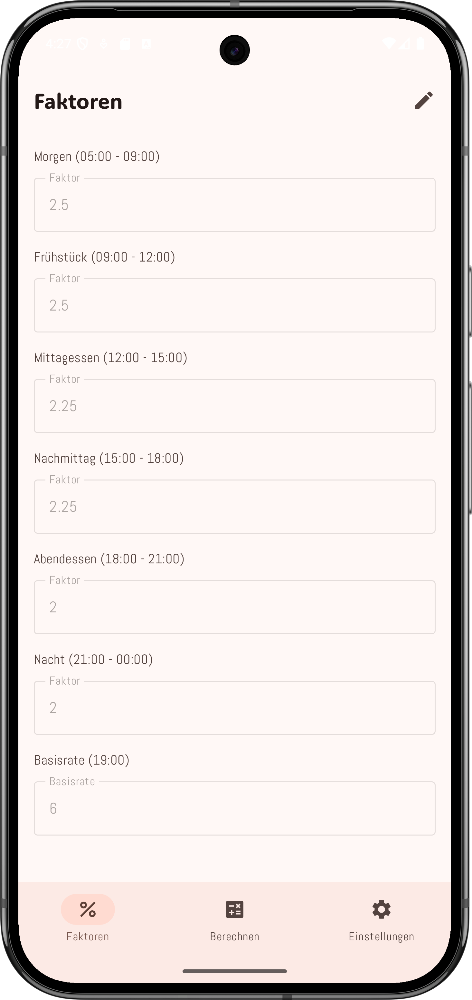

# Diabetes App

     

## Inhaltsverzeichnis

- [Aktueller Stand](#aktueller-stand)
- [Features](#features)
- [Tech-Stack](#tech-stack)
- [Projektstruktur (Auszug)](#projektstruktur-auszug)
- [Voraussetzungen](#voraussetzungen)
- [Installation und Start](#installation-und-start)
- [Screenshot](#screenshot)
- [Geplante Erweiterungen](#geplante-erweiterungen)
- [Lizenz](#lizenz)

Eine Android-App auf Basis von Jetpack Compose zur Verwaltung von Diabetes-relevanten Faktoren (z. B. Tagesfaktoren und Basisrate) mit anpassbarer Darstellung und Sprache.

## Aktueller Stand

Das Projekt befindet sich in aktiver Entwicklung. Kernfunktionen für Faktor-Eingabe, Theme-/Kontrast-Steuerung und Sprachumschaltung sind bereits umgesetzt.

## Features

- Erfassung von 6 Tages-Faktoren (Morning, Breakfast, Lunch, Afternoon, Dinner, Night)
- Erfassung einer Basisrate (Basal Rate)
- Bearbeitungsmodus: Felder sind standardmässig schreibgeschützt und werden über einen Edit-Button entsperrt
- Eingabevalidierung beim Verlassen des Feldes:
  - Faktorfelder werden auf den nächsten Wert in `0.25`-Schritten aufgerundet
  - Basisrate wird auf die nächste gerade Zahl aufgerundet
- Adaptive Navigation mit separaten Screens für Faktoren, Berechnung (Platzhalter) und Einstellungen
- Theme-Einstellungen: `System`, `Light`, `Dark`
- Kontrast-Einstellungen: `Normal`, `Medium`, `High`
- Sprachumschaltung: `System`, `Deutsch`, `English`
- Persistente App-Einstellungen über DataStore (bleiben nach App-Neustart erhalten)

## Tech-Stack

- Kotlin
- Android Gradle Plugin `9.1.0`
- Jetpack Compose + Material 3
- Material Icons Extended
- DataStore Preferences für persistente Einstellungen
- JUnit / AndroidX Test für Tests

## Projektstruktur (Auszug)

- `app/src/main/java/sevynidd/diabetesapp/MainActivity.kt` - App-Start, Theme-Anbindung, Settings-Flow
- `app/src/main/java/sevynidd/diabetesapp/screens/` - Hauptscreens (`FactorScreen`, `CalculateScreen`, `MainWindow`)
- `app/src/main/java/sevynidd/diabetesapp/settings/` - Settings-Screens (Theme/Sprache)
- `app/src/main/java/sevynidd/diabetesapp/navigation/Navigation.kt` - Destinationen und Animationen
- `app/src/main/java/sevynidd/diabetesapp/localization/Localization.kt` - Übersetzungslogik (DE/EN/System)
- `app/src/main/java/sevynidd/diabetesapp/data/AppSettingsStore.kt` - Persistenz von Theme/Kontrast/Sprache
- `app/src/main/java/sevynidd/diabetesapp/ui/theme/` - Material-Theme inkl. Kontraststufen

## Voraussetzungen

- Android Studio (aktuelle stabile Version)
- JDK 11+ (Projekt ist auf Java 11 konfiguriert)
- Android SDK (laut Projekt aktuell `compileSdk 36`, `minSdk 31`)

## Installation und Start

1. Repository klonen
2. Projekt in Android Studio öffnen
3. Gradle-Sync ausführen
4. App auf Emulator oder Gerät starten

## Screenshot

## Geplante Erweiterungen

- Implementierung der Berechnungslogik im `CalculateScreen`
- Speicherung medizinischer Eingabedaten in einer lokalen Datenbank (z. B. Room)
- Erweiterung um weitere Validierungen und ggf. Export-/Importfunktionen

## Lizenz

Dieses Projekt steht unter der in `LICENSE` definierten Lizenz.
