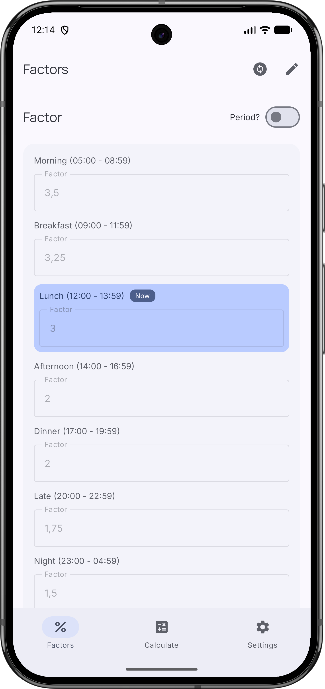

# Bolus Manager

      

Android app built with Jetpack Compose for managing diabetes-relevant factors, time windows, and bolus calculations. The app combines persistent factor and time profiles with a localized UI, theme/contrast settings, and a configurable bread-unit factor.

## Table of Contents

- [Current Status](#current-status)
- [Features](#features)
- [Data Persistence](#data-persistence)
- [Calculation Logic](#calculation-logic)
- [Validation & Input Behavior](#validation--input-behavior)
- [Tech Stack](#tech-stack)
- [Project Structure (Excerpt)](#project-structure-excerpt)
- [Requirements](#requirements)
- [Installation & Getting Started](#installation--getting-started)
- [Screenshot](#screenshot)
- [Roadmap](#roadmap)
- [License](#license)

## Current Status

The project is in active development, but already has a working workflow for:

- Factors and basal rate
- Time-of-day schedule with a pie chart
- Persistent storage via Room and DataStore
- Bolus calculation for **Normal** and **Split Bolus**
- Localized UI in multiple languages

## Features

### Factors & Schedule

- 7 time-of-day factors: Morning, Breakfast, Lunch, Afternoon, Dinner, Late, Night
- Basal rate as a separate field
- Read-only by default, editable via the edit icon in the top app bar
- Dedicated schedule screen with editable times via Material `TimePicker`
- Pie chart with colored time segments, titles, and times
- Schedule times are automatically kept in ascending order
- A hint text on the schedule screen explains the automatic order correction
- Factor descriptions dynamically show their saved time ranges

### Calculate

- Tab selection between **Normal** and **Split Bolus**
- **Normal mode**:
  - Carbohydrate input
  - Automatic, real-time unit calculation
  - Displays the currently active factor, including its name
- **Split bolus mode**:
  - Carbohydrate input
  - Immediate-share input as a percentage
  - Automatic rest share (`100 - immediate share`)
  - Editable duration (default: `120` minutes)
  - Immediate share calculated with the currently active factor
  - Rest share calculated with the factor active at `now + duration`
  - Current and future factors displayed side by side
  - Immediate and delayed units displayed side by side
- Configurable bread-unit value instead of a hardcoded divisor

### Settings

- Theme mode: `System`, `Light`, `Dark`
- Contrast level: `Normal`, `Medium`, `High`
- Language: `System`, `Deutsch`, `English`, `Français`, `Polski`
- Dedicated setting for **bread units**
- Animated navigation within settings

### UI & Navigation

- Adaptive navigation with `Factors`, `Calculate`, and `Settings`
- Material icons instead of drawable icons
- Material 3 UI with light/dark and contrast variants
- Multilingual text via a central translation function

## Data Persistence

### Room

Stored in `diabetes_app.db`, table `factor_profile`:

- All 7 factors
- Basal rate
- All schedule times:
  - Morning
  - Breakfast
  - Lunch
  - Afternoon
  - Dinner
  - Late
  - Night
  - Basal time

### DataStore Preferences

The following are persisted:

- Theme mode
- Contrast level
- Language
- Bread-unit value

### Edit Session / Save Behavior

Factor editing runs through `FactorEditSessionViewModel` + `SavedStateHandle`.

Auto-save is triggered on:

- Clicking Save (check icon)
- Leaving the `Factors` tab
- The app going to the background (`ON_STOP`)

Configuration changes (e.g. rotation) do not incorrectly trigger the background save (`isChangingConfigurations`).

## Calculation Logic

### Normal Bolus

The calculated units are based on:

- Entered carbohydrates
- Currently active factor
- Configured bread-unit value

Formula:

`Units = (Carbohydrates / BreadUnits) * Factor`

### Split Bolus

The split bolus divides the carbohydrates into two shares:

- **Immediate share**, using the currently active factor
- **Delayed share**, using the factor active at `now + duration`

This lets the second share account for a different time window than the first.

## Validation & Input Behavior

- Decimal values are entered and displayed with a comma (e.g. `1,25`)
- Factor fields are rounded up to the nearest `0.25` step on blur/commit
- Basal rate is rounded up to the nearest even number on blur/commit
- Fields normalize their values when edit mode ends, so focused inputs are still saved correctly
- Schedule times are automatically corrected to keep a valid order
- The split-bolus immediate share is capped at `100`
- The rest share is calculated automatically and therefore can never exceed `100`

## Tech Stack

- Kotlin `2.4.0`
- Android Gradle Plugin `9.2.1`
- Jetpack Compose BOM `2026.06.01`
- Material 3
- Material 3 Adaptive Navigation Suite
- Material Icons Extended
- Room `2.8.4`
- DataStore Preferences `1.2.1`
- Lifecycle Compose + ViewModel Compose
- KSP
- JUnit / AndroidX Test

## Project Structure (Excerpt)

- `app/src/main/java/sevynidd/diabetesapp/MainActivity.kt` - App startup, theme wiring, settings/factor flows
- `app/src/main/java/sevynidd/diabetesapp/screens/MainWindow.kt` - Scaffold, navigation, save trigger, and settings sub-screens
- `app/src/main/java/sevynidd/diabetesapp/screens/factors/FactorScreen.kt` - Factor UI with dynamic time ranges
- `app/src/main/java/sevynidd/diabetesapp/screens/factors/ScheduleFactorScreen.kt` - Schedule editor with pie chart and time picker
- `app/src/main/java/sevynidd/diabetesapp/screens/calculate/CalculateScreen.kt` - Normal/split bolus calculation UI
- `app/src/main/java/sevynidd/diabetesapp/screens/calculate/TemplateManagerScreen.kt` - Template selection and management for bolus calculation
- `app/src/main/java/sevynidd/diabetesapp/screens/settings/` - Theme, language, and bread-unit settings
- `app/src/main/java/sevynidd/diabetesapp/calculation/` - Plain-Kotlin bolus calculation logic (factor resolution, split-bolus math)
- `app/src/main/java/sevynidd/diabetesapp/data/database/` - Room (`DiabetesDatabase`, entities, DAOs, repositories)
- `app/src/main/java/sevynidd/diabetesapp/data/model/FactorsData.kt` - UI-friendly factor model
- `app/src/main/java/sevynidd/diabetesapp/data/settings/ThemeMode.kt` - Persisted theme mode
- `app/src/main/java/sevynidd/diabetesapp/data/AppSettingsStore.kt` - Persistence of theme, contrast, language, and bread units
- `app/src/main/java/sevynidd/diabetesapp/navigation/Navigation.kt` - Destinations and transitions
- `app/src/main/java/sevynidd/diabetesapp/localization/Localization.kt` - Translation logic for EN/DE/FR/PL/System
- `app/src/main/java/sevynidd/diabetesapp/libraries/gappedPieChart/` - Pie chart components

## Requirements

- Android Studio (current stable version)
- JDK 11+
- Android SDK (`compileSdk 36`, `minSdk 31`, `targetSdk 36`)

## Installation & Getting Started

1. Clone the repository
2. Open the project in Android Studio
3. Run a Gradle sync
4. Launch the app on an emulator or device

Optional CLI build:

```powershell
Set-Location "<repo-path>"
.\gradlew.bat :app:compileDebugKotlin --console=plain
```

## Screenshot



## Roadmap

- Additional medical rules and plausibility checks for calculations
- Optional: export/import of profiles
- Optional: cloud sync / backup
- UI polish for the Calculate and Settings screens

## License

This project is licensed under the terms defined in `LICENSE`.
